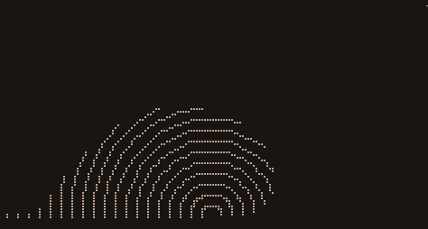

# drawille-canvas



HTML5 Canvas API for [`drawille`](https://github.com/madbence/node-drawille).

## Install

```
$ npm install drawille-canvas
```

In node `v0.10` it's a bit slow, with node `v0.11` it runs very smoothly.

## Usage

See [example](example.js), check out in the console (`node example`) or in the [browser](http://madbence.github.io/node-drawille-canvas/) (`example.html`).

## API

### new Canvas(width, height)

Create a new `Canvas` with the given dimensions.
For method details, see [`CanvasRenderingContext2D` on MDN](https://developer.mozilla.org/en-US/docs/Web/API/CanvasRenderingContext2D)

### c.fillRect(x, y, w, h)

Fill the given area of the canvas.

### c.clearRect(x, y, w, h)

Clear the given area of the canvas.

### c.save()

Save the current transformation matrix on the stack.

### c.restore()

Restore the last transformation matrix.

### c.translate(x, y)

Translate the current transformation matrix.

### c.rotate(a)

Rotate the current transformation matrix with the given angles.

### c.scale(x, y)

Scale the current transformation matrix.

### c.beginPath()

Start a new path.

### c.closePath()

Close the current path.

### c.moveTo(x, y)

Move the starting point of the next segment to the given coordinates.

### c.lineTo(x, y)

Connect the starting point with the given point with a straight line.

### c.arc(x, y, radius, start_angle, end_angle, anticlockwise)

Draw an arc between two angles at centre x, y.

### c.stroke()

Stroke the current path.

### c.fill()

Fill the current path.

### c.getContext('2d')

Return canvas itself, for compliance with browser.

### c.width, c.height

Canvas dimensions.

### c.toString()

Return the current content of canvas as a string with braille characters.

### c.getImageData(sx, sy, sw, sh)

Return an ImageData object `{ width, height, data }`, representing the underlying canvas data for the area of the canvas denoted by the rectangle which starts at `sx`, `sy` and has an `sw` width and `sh` height. `data` property is a string with braille characters.

### c.putImageData(imagedata, dx, dy [, dirtyX, dirtyY, dirtyWidth, dirtyHeight])

Paint data from the given _imagedata_ object `{ width, height, data }` onto the canvas. If a dirty rectangle is provided, only the area from that rectangle is painted.

## License

MIT
